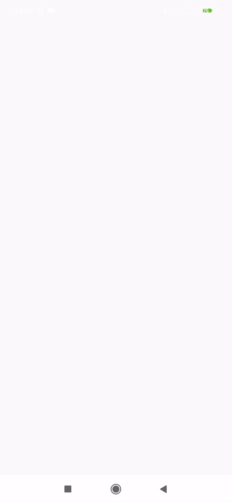
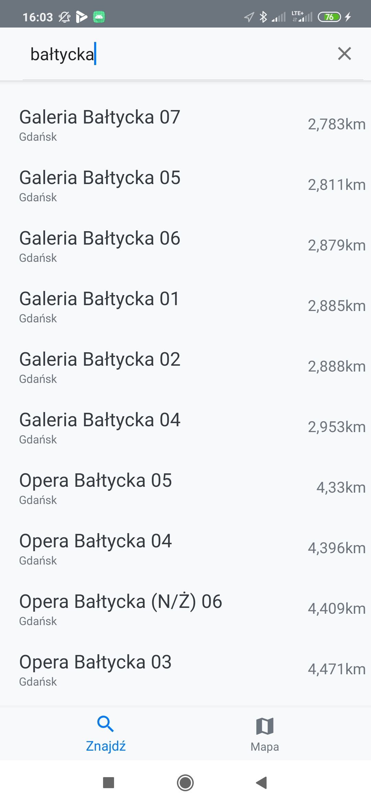
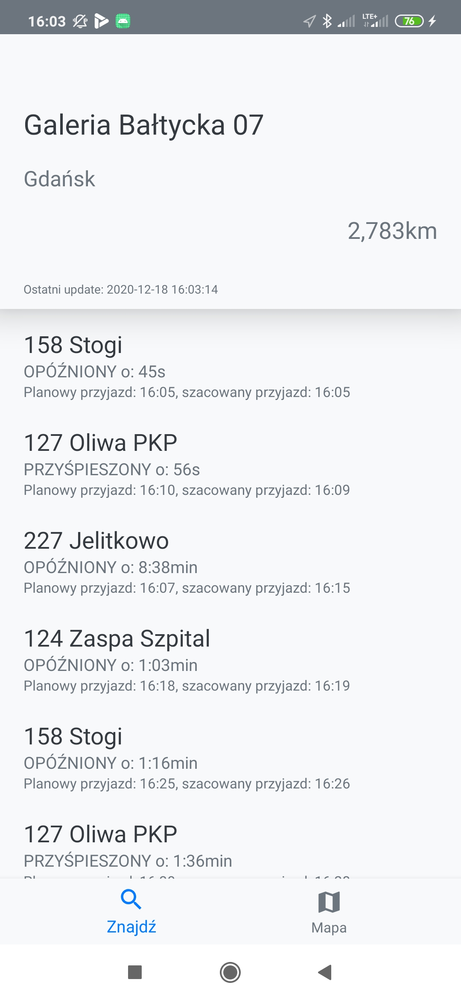
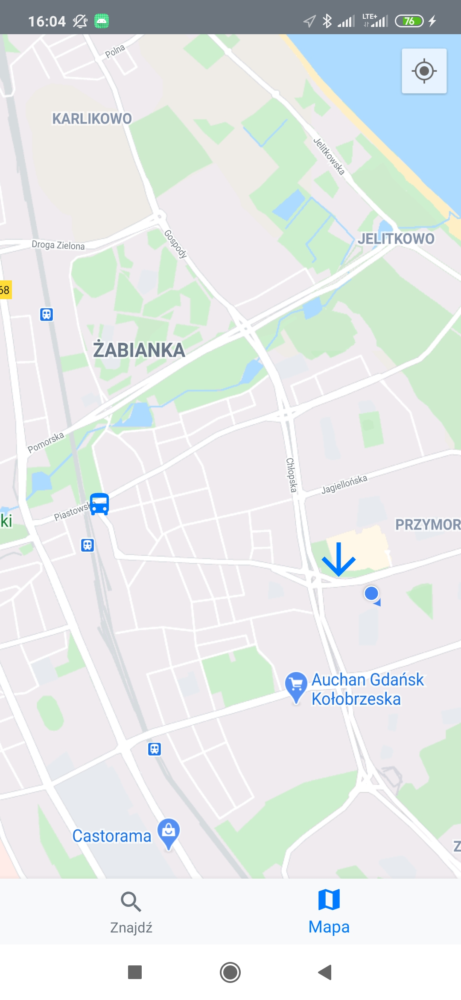

# ZTM Gdańsk - Buss location
>Jest to aplikacja stworzona na system android. Za pomocą aplikacji można wyszukać dowolny przystanek autobusowy i tramwajowy w gdańsku, bądź sprawdzić najbliższy naszemu położeniu. W czasie rzeczywistym są zaprezentowane dane na temat najbliższych autobusów, ich szacowany czas przyjazdu oraz czy są opoźnione. Można też śledzić położenie autobusu za pomocą map google. 

## Table of contents
* [General info](#general-info)
* [Screenshots](#screenshots)
* [Technologies](#technologies)
* [Setup](#setup)
* [Features](#features)
* [Status](#status)
* [Contact](#contact)

## General info
> A więc skąd są dane? Dane w czasie rzeczywistym są udostępnione przez ckan.multimediagdansk.pl, w ich skład wchodzi między innymi położenie przystanków, autobusów, tramwajów oraz estymowane czasy przyjazdów na dany przystanek.W momencie pierwszego uruchomienia urzytkownik jest proszony o przydzielenie uprawnień do lokalizacji i internetu. Jeżeli urzytkownik nie wyrazi zgody aplikacja nie pokazuje najbliższych przystanków tylko wyświetla ich listę w nieuporządkowany sposób. Po wybraniu interesującego nas przystanku prezentowana jest lista autobusów które będą się zatrzymywać na tym przystanku, autobusy wyświetlone są wraz z informacjiami o której jest planowany przyjazd, o której realnie można się spodziewać autobusu oraz czy autobus jest opóźniony, jeśli jest to o ile. Po wybraniu interesującego nas środka transporu aplikaja przenośi urzytkownika do map google gdzie zaznaczona jest aktualna lokalizacja urzytkownika, wybranego przystanka oraz środka komunikacji który został wybrany do śledzenia. Mapy odświeżają się automatycznie gdy wykryją ruch autobusu i uaktualniają jego pozycję. Precyzja aplikacji wynosi 20s, jest to spowodowane środkami bezpieczeństwa które narzuciło API.

## Screenshots
1. Overview

 

2. Main UI

 

3. Details UI

 

4. Map UI

 

# Technologies
* Java
* Android Studio
* MVVM - ViewModel & LiveData
* DI - Dagger2 
* UI - RecyclerView & MaterialDesign
* REST - Retrofit
* RxJava & RxAndroid & RxLocation
* GoogleMaps
* EasyPermissions

## Setup

### Create Constans file
> xxxxxxxxxxxxxxxx

## Features
* adasd
* asdasd

## Status
Finished

## Contact
Feel free to contact Adrian Wozniak (adrianwozniak576@gmail.com)

